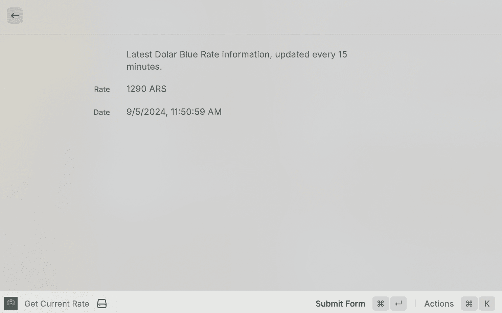

# Dolar Blue

Get Argentinian dolar "blue" actual and historical price.

## Reference:
- https://developers.raycast.com/basics/getting-started

## Develop

```bash
npm i && npm run dev
```

## Commands:

### Get actual price


### Get historical price
